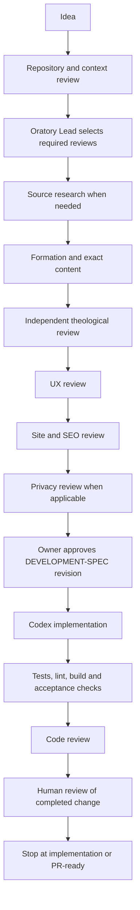

# Feature workflow

Copy [_template](_template/IDEA.md) to `docs/features/<feature-id>/`. Start by completing IDEA. Small changes may combine research/reviews into `REVIEWS.md`, as the [pilot](prayer-card-copy-label/IDEA.md) does; keep DEVELOPMENT-SPEC as the single implementation contract.

## Stages and decisions

Record not-applicable stages in IDEA with evidence and a reason. Return findings to the responsible author, revise the spec/content and repeat affected reviews. A blocked required review prevents implementation of the affected scope. Approval of one revision does not approve later substantive changes.

| Change trigger | Required work |
| --- | --- |
| Any feature | Repository/context review, Lead triage, DEVELOPMENT-SPEC, appropriate verification, code/diff review, human gate |
| New/changed theological, devotional or attributed text; changed meaning/order with theological consequences | Source research, Formation and independent Catholic Review; UX if presented interactively |
| Confession, mortal/venial sin, Eucharist, indulgences, sacramental requirements, liturgical rules, saints/Scripture/CCC quotations, private revelation | Explicit high-risk flag and independent source/theological review whenever material changes; owner resolves publication suitability |
| User journey, controls, visual or spoken UI | UX/accessibility review; unchanged theology can be not-applicable with a content-preservation check |
| New/changed routes, metadata, navigation, links, redirects, schema or discoverability | Site/SEO review before route creation |
| Journals, examination answers, intentions, reflections, spiritual progress, analytics, APIs, storage, logs, exports or embeds | Privacy review of affected data flow; no exemption merely because storage is local |
| Instructions/docs-only with no public copy or runtime change | Link/path/diff validation; record why app tests/build are omitted, or run them as a labeled baseline |

## Approval record

Use a real owner instruction or explicit sign-off with date, approved revision/commit and scope. States: `draft`, `in-review`, `changes-required`, `approved-for-implementation`, `implemented-awaiting-human-review`. These do not mean production approval. Record release authorization separately; default is **not authorized**.

Do not manufacture a signature, reuse approval from unrelated work, or approve sources solely because the repository already includes them. An owner can explicitly authorize a well-specified task in the same conversation; record it instead of asking again.

The normal endpoint is a reviewed local diff or PR-ready package. Pushing main can deploy this repository. Do not execute release commands in SOURCE_OF_TRUTH merely because implementation is complete.

## Validation selection

Run commands from the canonical repository root; inspect package.json if it has changed.

| Scope | Checks |
| --- | --- |
| Application code | `npm run lint`, `npm run typecheck`, `npm run build`; focused tests and acceptance checks |
| Client stores | `npm run audit:client-stores`; storage unavailable/corrupt/clear/reload and hydration tests |
| Retreat / companion | `npm run test:retreat` / `npm run test:companion` where affected |
| Navigation | `npm run test:navigation` requires localhost:3000, Edge and the script's machine-specific Playwright installation |
| Routes / metadata | `npm run validate:urls`, `npm run seo:preflight`; browser canonical/schema/redirect checks |
| Citations | `npm run audit:citations` plus actual source/theological review; script is a detector, not verification |
| Images | Existing image workflow and `npm run images:check`; include asset attribution |
| UI | Keyboard, focus, accessible names/status, about 390px and desktop, zoom/reduced motion as relevant; inspect console/hydration |
| Sensitive data | Synthetic markers; inspect network/event payloads, URLs, console and clearing behavior; no real personal records in evidence |

Build invokes prebuild guards/image checks and postbuild rendering checks. Record exit codes, baseline failures and exact limitations. Never disable a guard to obtain a green result. Do not run IndexNow or calendar sync as a test: those can change external state.

## Example: initiate a future feature

> Act as Oratory Lead. Use docs/agents and docs/features to plan clearer accessible names for Copy Prayer buttons in the existing PrayerCard. Inspect callers, preserve all prayer text and visual styling, and create a small feature packet. Select only necessary reviews. Stop at a development specification and implementation plan; do not push or deploy.

## Example: engineering handoff after actual approval

> Implement docs/features/<feature-id>/DEVELOPMENT-SPEC.md revision <approved-revision>. The owner approved that revision in <actual instruction/date>; copy that evidence into the approval record. Read AGENTS.md and linked reviews. Implement only the acceptance criteria, preserve approved content, run the specified checks and produce IMPLEMENTATION-REPORT.md. Use independent review where useful. Stop at a local reviewed diff or PR-ready state. No push or deployment.

Angle-bracket fields must be filled from real evidence. This example does not itself authorize implementation. The sample pilot now records its actual owner approval and local implementation in its own specification and report.
